# Kamus Data Database SPOP PBB-P2

> Generated by [`prisma-markdown`](https://github.com/samchon/prisma-markdown)

- [default](#default)

## default

```mermaid
erDiagram
"user_activities" {
  String id_activity PK
  String id_user FK
  String(50) type
  String(255) title
  DateTime created_at
}
"lampiran_dokumen" {
  String id_dokumen PK
  String id_transaksi FK,UK
  Json url_ktp
  Json url_sertifikat
  Json url_ajb
  Json url_imb
  Json url_pendukung_lokasi
  Json url_surat_kuasa
  String(255) keterangan_dokumen "nullable"
  DateTime uploaded_at
  String uploaded_by FK
}
"notifikasi" {
  String id PK
  String user_id FK
  String title
  String message
  Boolean is_read
  String type
  String reference_id "nullable"
  DateTime created_at
}
"objek_pajak" {
  String(18) nop PK
  String(10) kode_wilayah FK
  String(3) kode_blok
  String(4) no_urut
  String(1) kode_jenis_op
  String(16) nik_subjek FK
  String(20) no_persil "nullable"
  String(255) jalan_op
  String(50) blok_kav_no "nullable"
  String(5) rw_op "nullable"
  String(5) rt_op "nullable"
  JenisTanah jenis_tanah
  Decimal(10) luas_tanah
  Decimal(10) luas_bangunan
  Int jumlah_bangunan
  Decimal(15) njop_tanah "nullable"
  Decimal(15) njop_bangunan "nullable"
  Decimal(15) njop_total "nullable"
  Int tahun_penilaian "nullable"
  Boolean status_aktif
  String nonaktif_oleh FK "nullable"
  DateTime nonaktif_at "nullable"
  DateTime created_at
  Json koordinat_polygon "nullable"
  String(25) nip_pendata "nullable"
  String(25) nip_pemeriksa "nullable"
  DateTime oracle_synced_at "nullable"
  Boolean oracle_source
}
"objek_bumi" {
  String id_bumi PK
  String(18) nop FK
  Int no_bumi
  String(2) kode_znt "nullable"
  Decimal(12) luas_bumi
  String(1) jenis_bumi "nullable"
  Decimal(15) nilai_sistem_bumi
  Boolean status_blokir
  String(150) keterangan_blokir "nullable"
  String(4) tahun_blokir "nullable"
  DateTime updated_at
  String(25) nip_pendata "nullable"
  String(25) nip_pemeriksa "nullable"
  DateTime oracle_synced_at "nullable"
}
"objek_bangunan" {
  String id_bangunan PK
  String(18) nop FK
  Int no_bangunan
  String(2) kode_jpb FK "nullable"
  String(11) no_formulir_lspop "nullable"
  Int tahun_dibangun "nullable"
  Int tahun_renovasi "nullable"
  Decimal(12) luas_bangunan
  Int jumlah_lantai
  Int daya_listrik_watt "nullable"
  KondisiBangunan kondisi_bangunan "nullable"
  JenisKonstruksi jenis_konstruksi "nullable"
  JenisAtap jenis_atap "nullable"
  JenisDinding kode_dinding "nullable"
  JenisLantai kode_lantai "nullable"
  JenisLangitLangit kode_langit_langit "nullable"
  Decimal(15) nilai_sistem_bangunan "nullable"
  DateTime tanggal_pendataan
  String(25) nip_pendata "nullable"
  String(25) nip_pemeriksa "nullable"
  String(50) keterangan_jpb "nullable"
  DateTime created_at
  DateTime oracle_synced_at "nullable"
}
"objek_bangunan_fasilitas" {
  String id_fasilitas PK
  String(36) id_bangunan FK,UK
  Int jumlah_ac_split
  Int jumlah_ac_window
  Boolean ac_sentral
  Decimal(10) luas_kolam_renang
  Boolean kolam_diplester
  Boolean kolam_dengan_pelapis
  Decimal(10) perkerasan_ringan
  Decimal(10) perkerasan_sedang
  Decimal(10) perkerasan_berat
  Decimal(10) perkerasan_dengan_penutup
  Int tenis_beton_dgn_lampu
  Int tenis_beton_tanpa_lampu
  Int tenis_aspal_dgn_lampu
  Int tenis_aspal_tanpa_lampu
  Int tenis_tanah_rumput_dgn_lampu
  Int tenis_tanah_rumput_tanpa_lampu
  Int lift_penumpang
  Int lift_kapsul
  Int lift_barang
  Int tangga_berjalan_lbr_kurang_080m
  Int tangga_berjalan_lbr_lebih_080m
  Decimal(10) panjang_pagar_m
  BahanPagar bahan_pagar "nullable"
  Boolean hydrant_ada
  Boolean sprinkler_ada
  Boolean fire_alarm_ada
  Int jumlah_saluran_pabx
  Decimal(6) kedalaman_sumur_artesis_m
  DateTime updated_at
}
"pejabat_desa" {
  String(25) nip PK
  String(100) nama_pejabat
  String(100) jabatan
  String(10) kode_wilayah FK
}
"referensi_dbkb" {
  String id_dbkb PK
  KategoriDbkb kategori
  String(50) kode
  Decimal(15) nilai_per_m2
  Int tahun_berlaku
  String sumber_data
  DateTime synced_at "nullable"
  DateTime created_at
  DateTime updated_at
}
"referensi_nilai_fasilitas" {
  String id_nilai_fasilitas PK
  JenisFasilitas jenis_fasilitas
  Decimal(15) nilai_tambah
  Int tahun_berlaku
  String sumber_data
  DateTime synced_at "nullable"
  DateTime created_at
  DateTime updated_at
}
"referensi_jenis_penggunaan_bangunan" {
  String(2) kode_jpb PK
  String(50) nama_jpb
  Int urutan
  Boolean is_active
  String(150) keterangan "nullable"
  DateTime created_at
  DateTime updated_at
}
"riwayat_pelacakan" {
  String id_riwayat PK
  String id_transaksi FK
  StatusAjuan status_lama "nullable"
  StatusAjuan status_baru
  String id_user FK
  String(500) catatan "nullable"
  DateTime created_at
}
"sektor" {
  String(2) kode_sektor PK
  String(100) nama_sektor
}
"sppt" {
  String id_sppt PK
  String(18) nop FK
  Int tahun_pajak
  Decimal(15) njop_kena_pajak
  Decimal(15) njoptkp
  Decimal(5) tarif_pbb
  Decimal(15) pbb_terutang
  DateTime tgl_jatuh_tempo
  StatusBayar status_bayar
  DateTime tgl_bayar "nullable"
  String generated_by FK
  DateTime generated_at
  String id_transaksi_asal FK "nullable"
}
"subjek_pajak" {
  String(16) nik PK
  String(30) legacy_subjek_id UK "nullable"
  String(100) nama_subjek
  StatusWp status_wp
  Pekerjaan pekerjaan
  String(20) npwp "nullable"
  String(50) npwpd "nullable"
  String(15) no_hp "nullable"
  String(100) email "nullable"
  String(255) alamat_jalan
  String(50) blok_kav_no_subjek "nullable"
  String(5) rw "nullable"
  String(5) rt "nullable"
  String(100) kelurahan_wp "nullable"
  String(100) kecamatan_wp "nullable"
  String(100) kabupaten_wp "nullable"
  String(5) kode_pos "nullable"
  DateTime created_at
  DateTime updated_at
  String created_by FK
  DateTime oracle_synced_at "nullable"
  Boolean oracle_source
}
"sync_log" {
  String id PK
  String(50) table_name
  String(20) sync_type
  String(20) status
  Int rows_synced
  DateTime started_at
  DateTime completed_at "nullable"
  String error_message "nullable"
  String triggered_by
}
"transaksi_spop" {
  String id_transaksi PK
  String(20) no_formulir "nullable"
  String id_user FK
  String(25) nip_pemeriksa_desa "nullable"
  String(500) url_dokumen_fisik "nullable"
  Int tahun_pajak
  JenisTransaksi jenis_transaksi
  String(18) nop_bersama FK "nullable"
  String(20) no_sppt_lama "nullable"
  String(100) nama_pengaju "nullable"
  Boolean menggunakan_kuasa
  DateTime tanggal_pengajuan
  StatusAjuan status_ajuan
  String id_verifikator FK "nullable"
  DateTime verified_at "nullable"
  String catatan_bakeuda "nullable"
  String(500) peringatan_validasi "nullable"
  String(500) catatan_pengaju "nullable"
  String locked_by FK "nullable"
  DateTime locked_at "nullable"
  DateTime created_at
  DateTime updated_at
}
"detail_transaksi_asal" {
  String id_detail_asal PK
  String id_transaksi FK
  String(18) nop_asal FK "nullable"
  Boolean nonaktifkan_saat_disetujui
}
"detail_transaksi_tujuan" {
  String id_detail_tujuan PK
  String id_transaksi FK
  String(16) nik_calon_subjek "nullable"
  Decimal(10) luas_tanah_baru
  Decimal(10) luas_bangunan_baru
  Int jumlah_bangunan_baru
  JenisTanah jenis_tanah_baru "nullable"
  String(255) jalan_op_baru "nullable"
  String(5) rt_op_baru "nullable"
  String(5) rw_op_baru "nullable"
  String(50) blok_kav_no_baru "nullable"
  String(10) kode_wilayah_baru "nullable"
  String(3) kode_blok_baru "nullable"
  String(100) kelurahan_op_baru "nullable"
  String(100) kecamatan_op_baru "nullable"
  String(20) no_persil_baru "nullable"
  String(18) nop_generated "nullable"
  String(50) latitude "nullable"
  String(50) longitude "nullable"
  Json koordinat_polygon "nullable"
  String(50) batas_utara "nullable"
  String(50) batas_selatan "nullable"
  String(50) batas_timur "nullable"
  String(50) batas_barat "nullable"
  Json data_bangunan_json "nullable"
  Json calon_subjek_json "nullable"
}
"users" {
  String id_user PK
  String(50) username UK
  String(255) password_hash
  String(100) nama_lengkap
  Role role
  String(10) kode_wilayah FK "nullable"
  String(25) nip "nullable"
  Boolean is_active
  Boolean force_change_password
  DateTime created_at
}
"wilayah" {
  String(10) kode_wilayah PK
  String(2) kode_propinsi
  String(50) nama_propinsi
  String(2) kode_dati2
  String(100) kabupaten
  String(3) kode_kecamatan
  String(100) kecamatan
  String(3) kode_kelurahan
  String(100) nama_desa
  Boolean is_active
  DateTime created_at
  DateTime updated_at
  String(2) kode_sektor FK "nullable"
}
"referensi_blok" {
  String id_blok PK
  String(10) kode_wilayah FK
  String(3) kode_blok
  String(100) keterangan "nullable"
  String sumber_data
  DateTime created_at
}
"user_activities" }o--|| "users" : user
"lampiran_dokumen" |o--|| "transaksi_spop" : transaksi
"lampiran_dokumen" }o--|| "users" : uploader
"notifikasi" }o--|| "users" : user
"objek_pajak" }o--|| "wilayah" : wilayah
"objek_pajak" }o--|| "subjek_pajak" : subjek_pajak
"objek_pajak" }o--o| "users" : user_nonaktif
"objek_bumi" }o--|| "objek_pajak" : objek_pajak
"objek_bangunan" }o--|| "objek_pajak" : objek_pajak
"objek_bangunan" }o--o| "referensi_jenis_penggunaan_bangunan" : referensi_jpb
"objek_bangunan_fasilitas" |o--|| "objek_bangunan" : objek_bangunan
"pejabat_desa" }o--|| "wilayah" : wilayah
"riwayat_pelacakan" }o--|| "transaksi_spop" : transaksi
"riwayat_pelacakan" }o--|| "users" : user
"sppt" }o--|| "objek_pajak" : objek_pajak
"sppt" }o--|| "users" : generator
"sppt" }o--o| "transaksi_spop" : transaksi_asal
"subjek_pajak" }o--|| "users" : user
"transaksi_spop" }o--|| "users" : pengaju
"transaksi_spop" }o--o| "users" : verifikator
"transaksi_spop" }o--o| "users" : reviewer
"transaksi_spop" }o--o| "objek_pajak" : objek_bersama
"detail_transaksi_asal" }o--|| "transaksi_spop" : transaksi
"detail_transaksi_asal" }o--o| "objek_pajak" : objek_asal
"detail_transaksi_tujuan" }o--|| "transaksi_spop" : transaksi
"users" }o--o| "wilayah" : wilayah
"wilayah" }o--o| "sektor" : sektor
"referensi_blok" }o--|| "wilayah" : wilayah
```

### `user_activities`

Properties as follows:

- `id_activity`:
- `id_user`:
- `type`:
- `title`:
- `created_at`:

### `lampiran_dokumen`

Properties as follows:

- `id_dokumen`:
- `id_transaksi`:
- `url_ktp`:
- `url_sertifikat`:
- `url_ajb`:
- `url_imb`:
- `url_pendukung_lokasi`:
- `url_surat_kuasa`:
- `keterangan_dokumen`:
- `uploaded_at`:
- `uploaded_by`:

### `notifikasi`

Properties as follows:

- `id`:
- `user_id`:
- `title`:
- `message`:
- `is_read`:
- `type`:
- `reference_id`:
- `created_at`:

### `objek_pajak`

Properties as follows:

- `nop`:
- `kode_wilayah`:
- `kode_blok`:
- `no_urut`:
- `kode_jenis_op`:
- `nik_subjek`:
- `no_persil`:
- `jalan_op`:
- `blok_kav_no`:
- `rw_op`:
- `rt_op`:
- `jenis_tanah`:
- `luas_tanah`:
- `luas_bangunan`:
- `jumlah_bangunan`:
- `njop_tanah`:
- `njop_bangunan`:
- `njop_total`:
- `tahun_penilaian`:
- `status_aktif`:
- `nonaktif_oleh`:
- `nonaktif_at`:
- `created_at`:
- `koordinat_polygon`:
- `nip_pendata`:
- `nip_pemeriksa`:
- `oracle_synced_at`:
- `oracle_source`:

### `objek_bumi`

Properties as follows:

- `id_bumi`:
- `nop`:
- `no_bumi`:
- `kode_znt`:
- `luas_bumi`:
- `jenis_bumi`:
- `nilai_sistem_bumi`:
- `status_blokir`:
- `keterangan_blokir`:
- `tahun_blokir`:
- `updated_at`:
- `nip_pendata`:
- `nip_pemeriksa`:
- `oracle_synced_at`:

### `objek_bangunan`

Properties as follows:

- `id_bangunan`:
- `nop`:
- `no_bangunan`:
- `kode_jpb`:
- `no_formulir_lspop`:
- `tahun_dibangun`:
- `tahun_renovasi`:
- `luas_bangunan`:
- `jumlah_lantai`:
- `daya_listrik_watt`:
- `kondisi_bangunan`:
- `jenis_konstruksi`:
- `jenis_atap`:
- `kode_dinding`:
- `kode_lantai`:
- `kode_langit_langit`:
- `nilai_sistem_bangunan`:
- `tanggal_pendataan`:
- `nip_pendata`:
- `nip_pemeriksa`:
- `keterangan_jpb`:
- `created_at`:
- `oracle_synced_at`:

### `objek_bangunan_fasilitas`

Properties as follows:

- `id_fasilitas`:
- `id_bangunan`:
- `jumlah_ac_split`:
- `jumlah_ac_window`:
- `ac_sentral`:
- `luas_kolam_renang`:
- `kolam_diplester`:
- `kolam_dengan_pelapis`:
- `perkerasan_ringan`:
- `perkerasan_sedang`:
- `perkerasan_berat`:
- `perkerasan_dengan_penutup`:
- `tenis_beton_dgn_lampu`:
- `tenis_beton_tanpa_lampu`:
- `tenis_aspal_dgn_lampu`:
- `tenis_aspal_tanpa_lampu`:
- `tenis_tanah_rumput_dgn_lampu`:
- `tenis_tanah_rumput_tanpa_lampu`:
- `lift_penumpang`:
- `lift_kapsul`:
- `lift_barang`:
- `tangga_berjalan_lbr_kurang_080m`:
- `tangga_berjalan_lbr_lebih_080m`:
- `panjang_pagar_m`:
- `bahan_pagar`:
- `hydrant_ada`:
- `sprinkler_ada`:
- `fire_alarm_ada`:
- `jumlah_saluran_pabx`:
- `kedalaman_sumur_artesis_m`:
- `updated_at`:

### `pejabat_desa`

Properties as follows:

- `nip`:
- `nama_pejabat`:
- `jabatan`:
- `kode_wilayah`:

### `referensi_dbkb`

Properties as follows:

- `id_dbkb`:
- `kategori`:
- `kode`:
- `nilai_per_m2`:
- `tahun_berlaku`:
- `sumber_data`:
- `synced_at`:
- `created_at`:
- `updated_at`:

### `referensi_nilai_fasilitas`

Properties as follows:

- `id_nilai_fasilitas`:
- `jenis_fasilitas`:
- `nilai_tambah`:
- `tahun_berlaku`:
- `sumber_data`:
- `synced_at`:
- `created_at`:
- `updated_at`:

### `referensi_jenis_penggunaan_bangunan`

Properties as follows:

- `kode_jpb`:
- `nama_jpb`:
- `urutan`:
- `is_active`:
- `keterangan`:
- `created_at`:
- `updated_at`:

### `riwayat_pelacakan`

Properties as follows:

- `id_riwayat`:
- `id_transaksi`:
- `status_lama`:
- `status_baru`:
- `id_user`:
- `catatan`:
- `created_at`:

### `sektor`

Properties as follows:

- `kode_sektor`:
- `nama_sektor`:

### `sppt`

Properties as follows:

- `id_sppt`:
- `nop`:
- `tahun_pajak`:
- `njop_kena_pajak`:
- `njoptkp`:
- `tarif_pbb`:
- `pbb_terutang`:
- `tgl_jatuh_tempo`:
- `status_bayar`:
- `tgl_bayar`:
- `generated_by`:
- `generated_at`:
- `id_transaksi_asal`:

### `subjek_pajak`

Properties as follows:

- `nik`:
- `legacy_subjek_id`:
- `nama_subjek`:
- `status_wp`:
- `pekerjaan`:
- `npwp`:
- `npwpd`:
- `no_hp`:
- `email`:
- `alamat_jalan`:
- `blok_kav_no_subjek`:
- `rw`:
- `rt`:
- `kelurahan_wp`:
- `kecamatan_wp`:
- `kabupaten_wp`:
- `kode_pos`:
- `created_at`:
- `updated_at`:
- `created_by`:
- `oracle_synced_at`:
- `oracle_source`:

### `sync_log`

Properties as follows:

- `id`:
- `table_name`:
- `sync_type`:
- `status`:
- `rows_synced`:
- `started_at`:
- `completed_at`:
- `error_message`:
- `triggered_by`:

### `transaksi_spop`

Properties as follows:

- `id_transaksi`:
- `no_formulir`:
- `id_user`:
- `nip_pemeriksa_desa`:
- `url_dokumen_fisik`:
- `tahun_pajak`:
- `jenis_transaksi`:
- `nop_bersama`:
- `no_sppt_lama`:
- `nama_pengaju`:
- `menggunakan_kuasa`:
- `tanggal_pengajuan`:
- `status_ajuan`:
- `id_verifikator`:
- `verified_at`:
- `catatan_bakeuda`:
- `peringatan_validasi`:
- `catatan_pengaju`:
- `locked_by`:
- `locked_at`:
- `created_at`:
- `updated_at`:

### `detail_transaksi_asal`

Properties as follows:

- `id_detail_asal`:
- `id_transaksi`:
- `nop_asal`:
- `nonaktifkan_saat_disetujui`:

### `detail_transaksi_tujuan`

Properties as follows:

- `id_detail_tujuan`:
- `id_transaksi`:
- `nik_calon_subjek`:
- `luas_tanah_baru`:
- `luas_bangunan_baru`:
- `jumlah_bangunan_baru`:
- `jenis_tanah_baru`:
- `jalan_op_baru`:
- `rt_op_baru`:
- `rw_op_baru`:
- `blok_kav_no_baru`:
- `kode_wilayah_baru`:
- `kode_blok_baru`:
- `kelurahan_op_baru`:
- `kecamatan_op_baru`:
- `no_persil_baru`:
- `nop_generated`:
- `latitude`:
- `longitude`:
- `koordinat_polygon`:
- `batas_utara`:
- `batas_selatan`:
- `batas_timur`:
- `batas_barat`:
- `data_bangunan_json`:
- `calon_subjek_json`:

### `users`

Properties as follows:

- `id_user`:
- `username`:
- `password_hash`:
- `nama_lengkap`:
- `role`:
- `kode_wilayah`:
- `nip`:
- `is_active`:
- `force_change_password`:
- `created_at`:

### `wilayah`

Properties as follows:

- `kode_wilayah`:
- `kode_propinsi`:
- `nama_propinsi`:
- `kode_dati2`:
- `kabupaten`:
- `kode_kecamatan`:
- `kecamatan`:
- `kode_kelurahan`:
- `nama_desa`:
- `is_active`:
- `created_at`:
- `updated_at`:
- `kode_sektor`:

### `referensi_blok`

Properties as follows:

- `id_blok`:
- `kode_wilayah`:
- `kode_blok`:
- `keterangan`:
- `sumber_data`:
- `created_at`:
