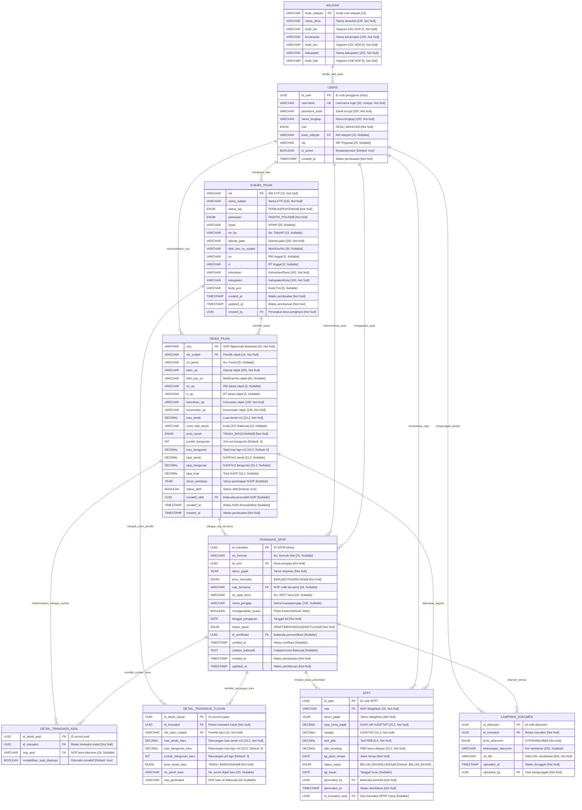

```mermaid
erDiagram
    USERS {
        UUID id_user PK "ID unik pengguna (Auto)"
        VARCHAR username UK "Username login [50, Unique, Not Null]"
        VARCHAR password_hash "Sandi bcrypt [255, Not Null]"
        VARCHAR nama_lengkap "Nama lengkap [100, Not Null]"
        ENUM role "DESA | BAKEUDA [Not Null]"
        VARCHAR kode_wilayah FK "Ref wilayah [10, Nullable]"
        VARCHAR nip "NIP Pegawai [25, Nullable]"
        BOOLEAN is_active "Mutasi/pensiun [Default: true]"
        TIMESTAMP created_at "Waktu pembuatan [Not Null]"
    }

    WILAYAH {
        VARCHAR kode_wilayah PK "Kode unik wilayah [10]"
        VARCHAR nama_desa "Nama desa/kel [100, Not Null]"
        VARCHAR kode_kel "Segmen KEL NOP [5, Not Null]"
        VARCHAR kecamatan "Nama kecamatan [100, Not Null]"
        VARCHAR kode_kec "Segmen KEC NOP [5, Not Null]"
        VARCHAR kabupaten "Nama kabupaten [100, Not Null]"
        VARCHAR kode_kab "Segmen KAB NOP [5, Not Null]"
    }

    SUBJEK_PAJAK {
        VARCHAR nik PK "NIK KTP [16, Not Null]"
        VARCHAR nama_subjek "Nama KTP [100, Not Null]"
        ENUM status_wp "PEMILIK|PENYEWA|dll [Not Null]"
        ENUM pekerjaan "PNS|TNI_POLRI|dll [Not Null]"
        VARCHAR npwp "NPWP [20, Nullable]"
        VARCHAR no_hp "No. Telp/HP [15, Nullable]"
        VARCHAR alamat_jalan "Alamat jalan [255, Not Null]"
        VARCHAR blok_kav_no_subjek "Blok/Kav/No [50, Nullable]"
        VARCHAR rw "RW tinggal [5, Nullable]"
        VARCHAR rt "RT tinggal [5, Nullable]"
        VARCHAR kelurahan "Kelurahan/Desa [100, Not Null]"
        VARCHAR kabupaten "Kabupaten/Kota [100, Not Null]"
        VARCHAR kode_pos "Kode Pos [5, Nullable]"
        TIMESTAMP created_at "Waktu pembuatan [Not Null]"
        TIMESTAMP updated_at "Waktu pembaruan [Not Null]"
        UUID created_by FK "Perangkat desa penginput [Not Null]"
    }

    OBJEK_PAJAK {
        VARCHAR nop PK "NOP digenerate Bakeuda [18, Not Null]"
        VARCHAR nik_subjek FK "Pemilik objek [16, Not Null]"
        VARCHAR no_persil "No. Persil [20, Nullable]"
        VARCHAR jalan_op "Alamat objek [255, Not Null]"
        VARCHAR blok_kav_no "Blok/Kav/No objek [50, Nullable]"
        VARCHAR rw_op "RW lokasi objek [5, Nullable]"
        VARCHAR rt_op "RT lokasi objek [5, Nullable]"
        VARCHAR kelurahan_op "Kelurahan objek [100, Not Null]"
        VARCHAR kecamatan_op "Kecamatan objek [100, Not Null]"
        DECIMAL luas_tanah "Luas tanah m2 [10,2, Not Null]"
        VARCHAR zona_nilai_tanah "Kode ZNT Bakeuda [10, Nullable]"
        ENUM jenis_tanah "TANAH_BANGUNAN|dll [Not Null]"
        INT jumlah_bangunan "Jml unit bangunan [Default: 0]"
        DECIMAL luas_bangunan "Total luas bgn m2 [10,2, Default: 0]"
        DECIMAL njop_tanah "NJOP/m2 tanah [15,2, Nullable]"
        DECIMAL njop_bangunan "NJOP/m2 bangunan [15,2, Nullable]"
        DECIMAL njop_total "Total NJOP [15,2, Nullable]"
        YEAR tahun_penilaian "Tahun penetapan NJOP [Nullable]"
        BOOLEAN status_aktif "Status aktif [Default: true]"
        UUID nonaktif_oleh FK "Bakeuda penonaktif NOP [Nullable]"
        TIMESTAMP nonaktif_at "Waktu NOP dinonaktifkan [Nullable]"
        TIMESTAMP created_at "Waktu pembuatan [Not Null]"
    }

    TRANSAKSI_SPOP {
        UUID id_transaksi PK "ID SPOP [Auto]"
        VARCHAR no_formulir "No. formulir fisik [20, Nullable]"
        UUID id_user FK "Desa pengaju [Not Null]"
        YEAR tahun_pajak "Tahun diajukan [Not Null]"
        ENUM jenis_transaksi "BARU|MUTASI|PECAH|dll [Not Null]"
        VARCHAR nop_bersama FK "NOP milik bersama [18, Nullable]"
        VARCHAR no_sppt_lama "No. SPPT lama [20, Nullable]"
        VARCHAR nama_pengaju "Nama kuasa/pengaju [100, Nullable]"
        BOOLEAN menggunakan_kuasa "Pakai kuasa [Default: false]"
        DATE tanggal_pengajuan "Tanggal ttd [Not Null]"
        ENUM status_ajuan "DRAFT|MENUNGGU|DISETUJUI|dll [Not Null]"
        UUID id_verifikator FK "Bakeuda pemverifikasi [Nullable]"
        TIMESTAMP verified_at "Waktu verifikasi [Nullable]"
        TEXT catatan_bakeuda "Catatan/revisi Bakeuda [Nullable]"
        TIMESTAMP created_at "Waktu pembuatan [Not Null]"
        TIMESTAMP updated_at "Waktu pembaruan [Not Null]"
    }

    DETAIL_TRANSAKSI_ASAL {
        UUID id_detail_asal PK "ID record asal"
        UUID id_transaksi FK "Relasi transaksi induk [Not Null]"
        VARCHAR nop_asal FK "NOP lama diproses [18, Nullable]"
        BOOLEAN nonaktifkan_saat_disetujui "Otomatis nonaktif [Default: true]"
    }

    DETAIL_TRANSAKSI_TUJUAN {
        UUID id_detail_tujuan PK "ID record tujuan"
        UUID id_transaksi FK "Relasi transaksi induk [Not Null]"
        VARCHAR nik_calon_subjek FK "Pemilik baru [16, Not Null]"
        DECIMAL luas_tanah_baru "Rancangan luas tanah m2 [10,2, Not Null]"
        DECIMAL luas_bangunan_baru "Rancangan luas bgn m2 [10,2, Default: 0]"
        INT jumlah_bangunan_baru "Rancangan jml bgn [Default: 0]"
        ENUM jenis_tanah_baru "TANAH_BANGUNAN|dll [Not Null]"
        VARCHAR no_persil_baru "No. persil objek baru [20, Nullable]"
        VARCHAR nop_generated "NOP baru dr Bakeuda [18, Nullable]"
    }

    LAMPIRAN_DOKUMEN {
        UUID id_dokumen PK "ID unik dokumen"
        UUID id_transaksi FK "Relasi transaksi [Not Null]"
        ENUM jenis_dokumen "KTP|SHM|AJB|dll [Not Null]"
        VARCHAR keterangan_dokumen "Ket tambahan [255, Nullable]"
        VARCHAR url_file "Path URL cloud/lokal [500, Not Null]"
        TIMESTAMP uploaded_at "Waktu diunggah [Not Null]"
        UUID uploaded_by FK "User pengunggah [Not Null]"
    }

    SPPT {
        UUID id_sppt PK "ID unik SPPT"
        VARCHAR nop FK "NOP ditagihkan [18, Not Null]"
        YEAR tahun_pajak "Tahun ditagihkan [Not Null]"
        DECIMAL njop_kena_pajak "NJOP stlh NJOPTKP [15,2, Not Null]"
        DECIMAL njoptkp "NJOPTKP [15,2, Not Null]"
        DECIMAL tarif_pbb "Tarif PBB [5,4, Not Null]"
        DECIMAL pbb_terutang "PBB harus dibayar [15,2, Not Null]"
        DATE tgl_jatuh_tempo "Jatuh tempo [Not Null]"
        ENUM status_bayar "BELUM_BAYAR|LUNAS|dll [Default: BELUM_BAYAR]"
        DATE tgl_bayar "Tanggal lunas [Nullable]"
        UUID generated_by FK "Bakeuda penerbit [Not Null]"
        TIMESTAMP generated_at "Waktu diterbitkan [Not Null]"
        UUID id_transaksi_asal FK "Dari transaksi SPOP mana [Nullable]"
    }

    %% ==========================================
    %% DEFINISI RELASI (FOREIGN KEYS)
    %% ==========================================
    WILAYAH ||--o{ USERS : "dimiliki_oleh_desa"
    USERS ||--o{ SUBJEK_PAJAK : "menginput_data"
    SUBJEK_PAJAK ||--o{ OBJEK_PAJAK : "memiliki_tanah"
    USERS ||--o{ OBJEK_PAJAK : "menonaktifkan_nop"
    
    USERS ||--o{ TRANSAKSI_SPOP : "mengajukan_spop"
    USERS ||--o{ TRANSAKSI_SPOP : "memverifikasi_spop"
    OBJEK_PAJAK ||--o{ TRANSAKSI_SPOP : "sebagai_nop_bersama"
    
    TRANSAKSI_SPOP ||--o{ DETAIL_TRANSAKSI_ASAL : "memiliki_sumber_lama"
    OBJEK_PAJAK ||--o{ DETAIL_TRANSAKSI_ASAL : "direferensikan_sebagai_sumber"
    
    TRANSAKSI_SPOP ||--o{ DETAIL_TRANSAKSI_TUJUAN : "memiliki_rancangan_baru"
    SUBJEK_PAJAK ||--o{ DETAIL_TRANSAKSI_TUJUAN : "menjadi_calon_pemilik"
    
    TRANSAKSI_SPOP ||--o{ LAMPIRAN_DOKUMEN : "dilampiri_berkas"
    USERS ||--o{ LAMPIRAN_DOKUMEN : "mengunggah_berkas"
    
    OBJEK_PAJAK ||--o{ SPPT : "dikenakan_tagihan"
    USERS ||--o{ SPPT : "menerbitkan_sppt"
    TRANSAKSI_SPOP ||--o{ SPPT : "menjadi_dasar_penerbitan"
```